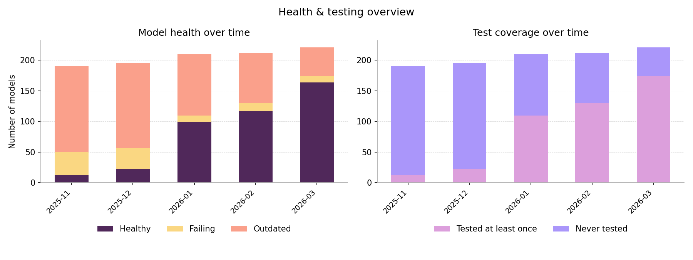
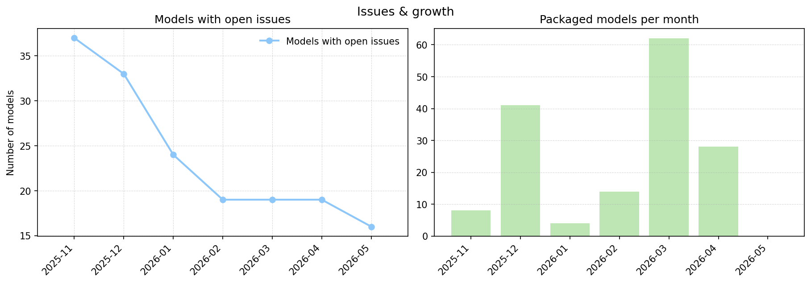
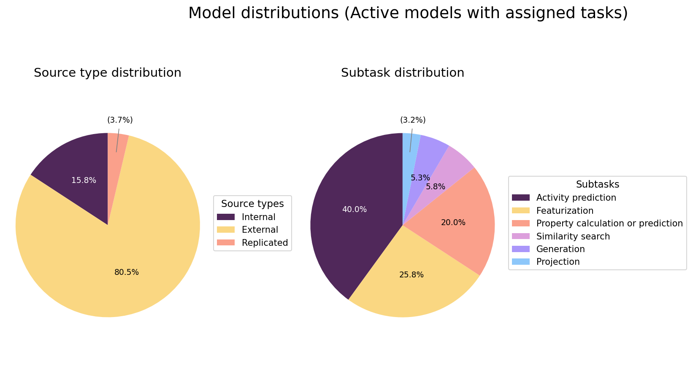

# 📊 Monthly Health Report

**Month:** 2025-11
**Generated at:** 2025-11-18 12:14:35Z (UTC)

## 🔢 Snapshot for this month

- 📦 **Total models:** 190
- ✅ **Healthy models:** 0
- 🔴 **Failing models:** 37
- ⏳ **Outdated models:** 153
- 🧪 **Tested at least once:** 0
- 🕳️ **Never tested:** 190
- ❗ **With open issues:** 37

## 🆕 Models packaged this month

| 🧬 Repository | 🪪 Slug |
|---------------|---------|
| eos1ut3 | molfeat-usrcat |
| eos2hbd | passive-permeability |
| eos2l0q | schisto-swisstph |
| eos3b5e | molecular-weight |
| eos5cl7 | ngonorrhoeae-inhibition |
| eos5pt8 | druglikeness-unsupervised |
| eos6ojg | antibioticdb-similarity-matches |
| eos9o72 | chemeleon |

## 📈 Global trends over time

### 🩺 Health & testing overview

### ❗ Issues & new models

### 🧩 Task & source type distributions (current snapshot)

