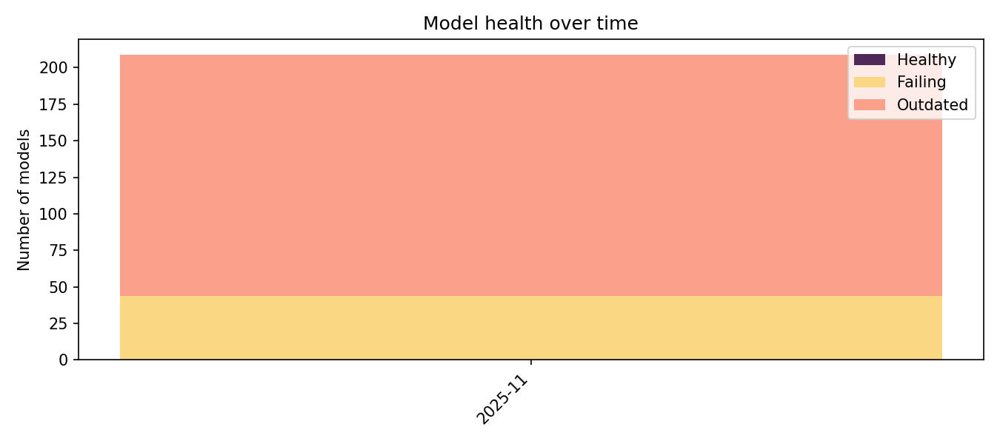
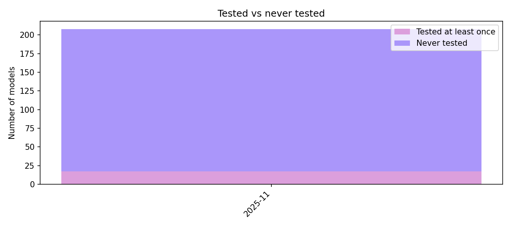
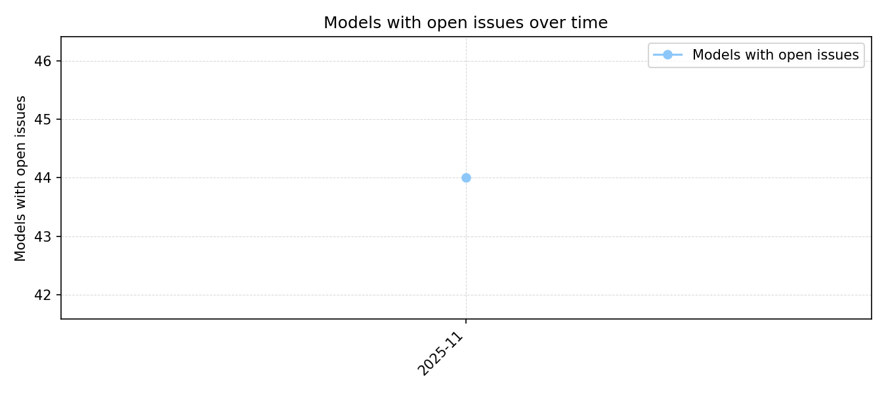
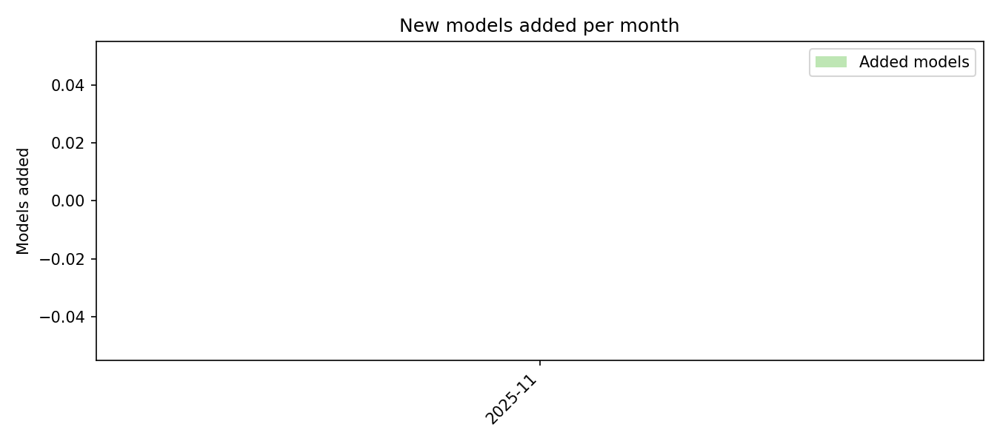
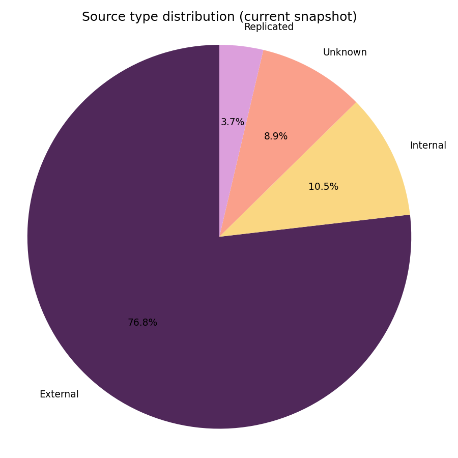
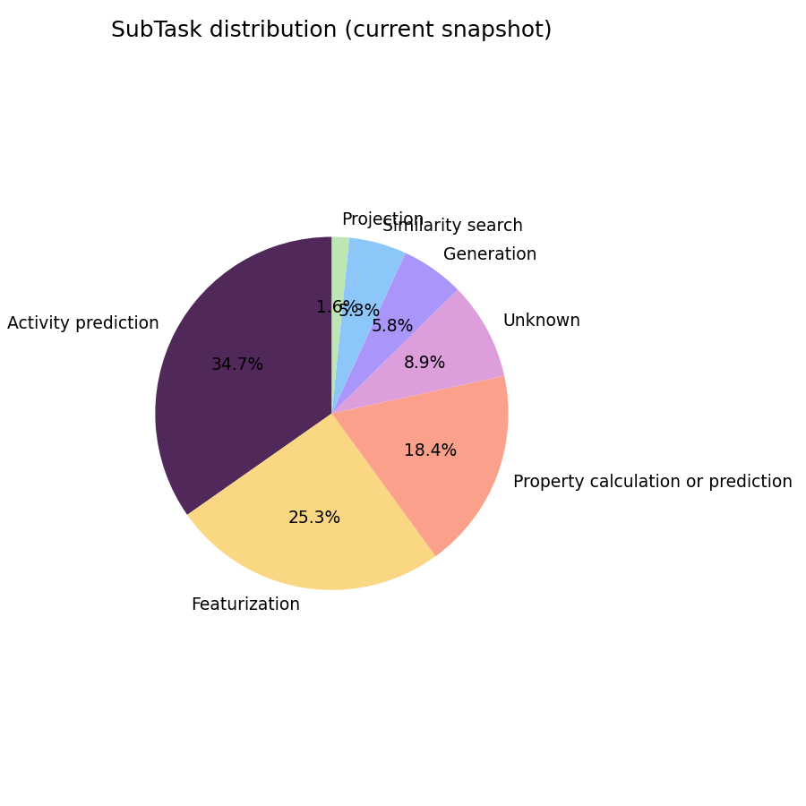

# 📊 Monthly Health Report

**Month:** 2025-11
**Generated at:** 2025-11-17 17:31:14Z (UTC)

## 📈 Global trends over time

### 🩺 Health status (Healthy / Failing / Outdated)

### 🧪 Tested vs never tested

### ❗ Models with open issues

### 🆕 Models added per month

### 🌍 Source type distribution (current snapshot)

### 🧩 Task distribution (current snapshot)

## 🔢 Snapshot for this month

- 📦 **Total models:** 209
- ✅ **Healthy models:** 0
- 🔴 **Failing models:** 44
- ⏳ **Outdated models:** 165
- 🧪 **Tested at least once:** 0
- 🕳️ **Never tested:** 209
- ❗ **With open issues:** 44

## 🆕 Models added this month

| 🧬 Repository | 🪪 Slug |
|---------------|---------|
| eos1bba | gem-representation-learning |
| eos1fl3 | macaw |
| eos1j4h | morgan-fingerprint-embedding |
| eos1tt2 | mole-embeddings |
| eos3e6s | chembl-decoys |
| eos3l5f | clamp |
| eos3nl8 | COVID-19-Drug-Repurposing |
| eos4f8y | one-molecule-mollib |
| eos69e6 | pgmg-pharmacophore |
| eos69mr | reinvent4-linkinvent |
| eos6ru5 | drugbank-11k-similarity-search |
| eos6wdw | dotP |
| eos7akz | pred-ms |
| eos7emx | small-world-sampler |
| eos85mn | farm-representation |
| eos8osp | hlm |
| eos8vud | squid |
| eos9aqt | delfta-qm |
| eos9uqy | cheese-sampler |

