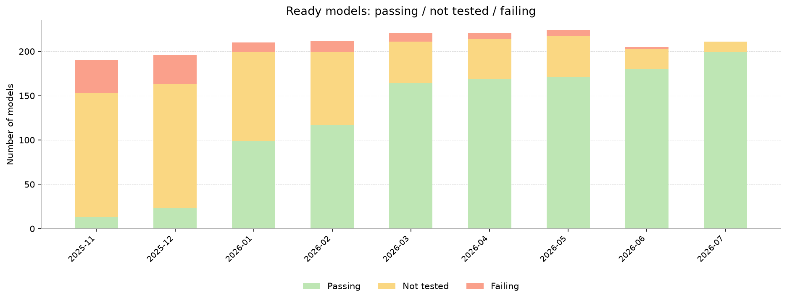
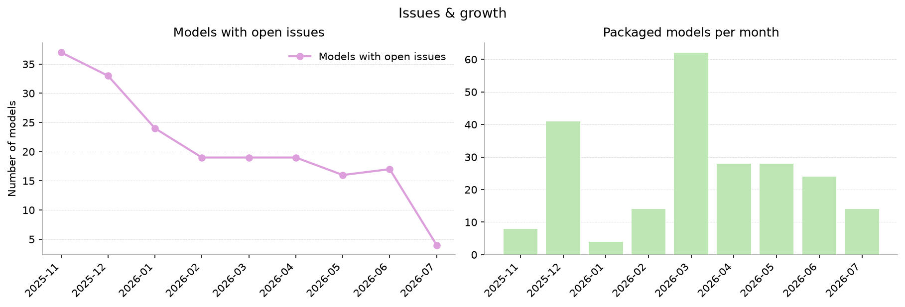
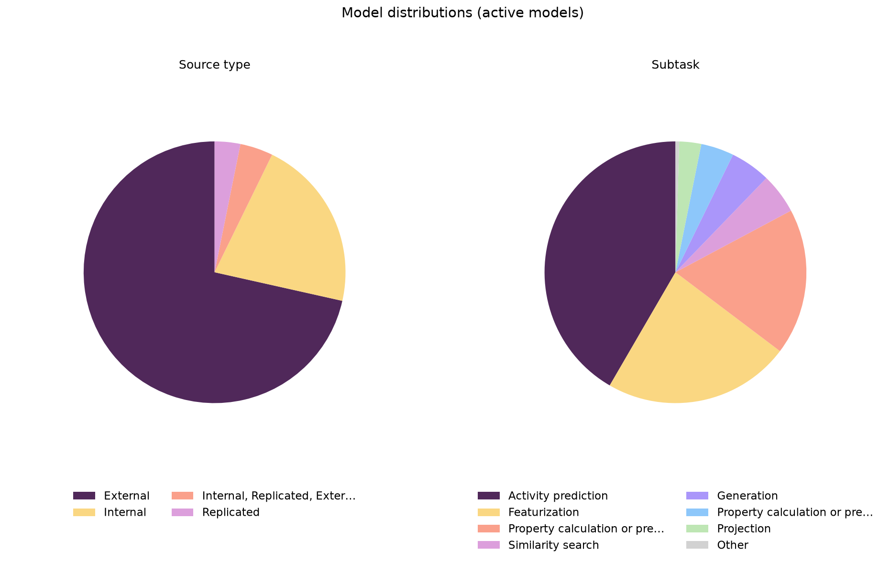

# 📊 Monthly Health Report

**Month:** 2026-04
**Generated at:** 2026-04-01 07:30:33Z (UTC)

## 🔢 Snapshot for this month

- 📦 **Total models:** 221
- ✅ **Healthy models:** 169
- 🔴 **Failing models:** 7
- ⏳ **Outdated models:** 45
- 🧪 **Tested at least once:** 176
- 🕳️ **Never tested:** 45
- ❗ **With open issues:** 19

## 🆕 Models packaged this month

_No new models were added this month._

## 📈 Global trends over time

### 🩺 Health & testing overview

### ❗ Issues & Packaged models

### 🧩 Task & source type distributions (current snapshot)

