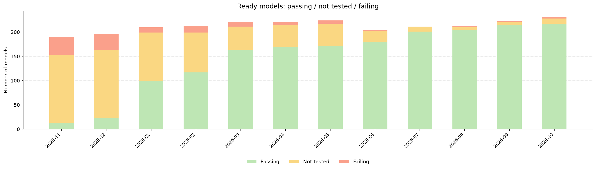
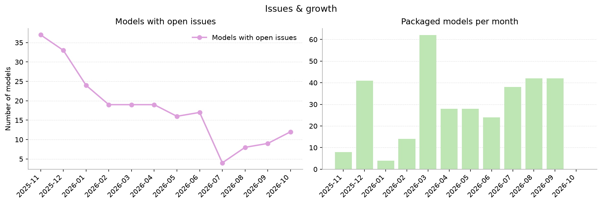
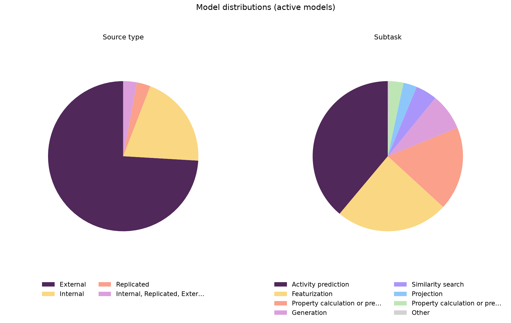

# 📊 Monthly Health Report

**Month:** 2026-10  
**Generated at:** 2026-10-01 01:35:20Z (UTC)

## 🔢 Snapshot

- 📦 **Total models:** 281
  - 🗄️ **Archived:** 38
  - ✅ **Ready — passing:** 217
  - ⏳ **Ready — not yet tested:** 11
  - 🔴 **Ready — failing:** 3
- ❗ **Non-archived with open issues:** 12

## 🆕 Models packaged this month

_No new models were packaged this month._

## 📈 Trends over time

### 🩺 Ready models: passing / not tested / failing

### ❗ Issues & packaged models

### 🧩 Task & source type distributions

